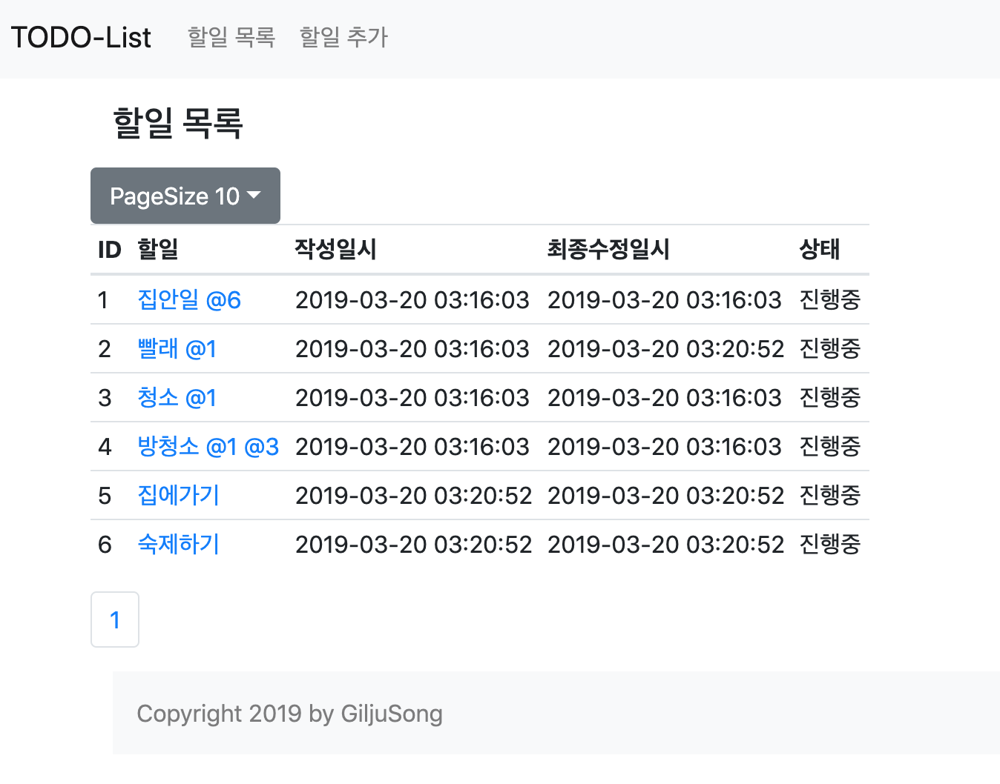
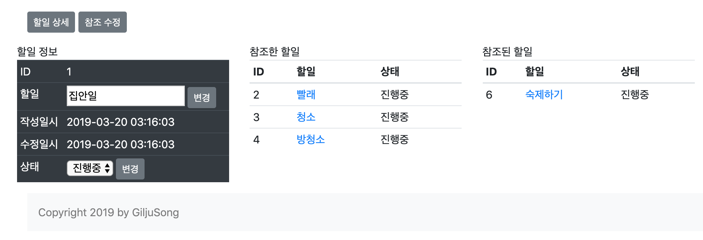
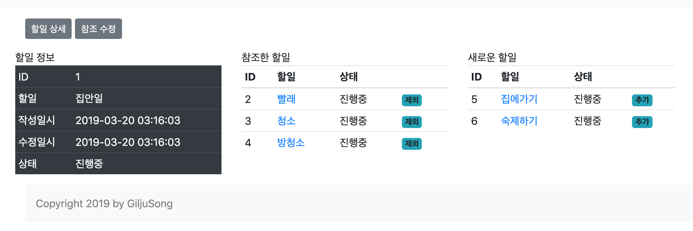
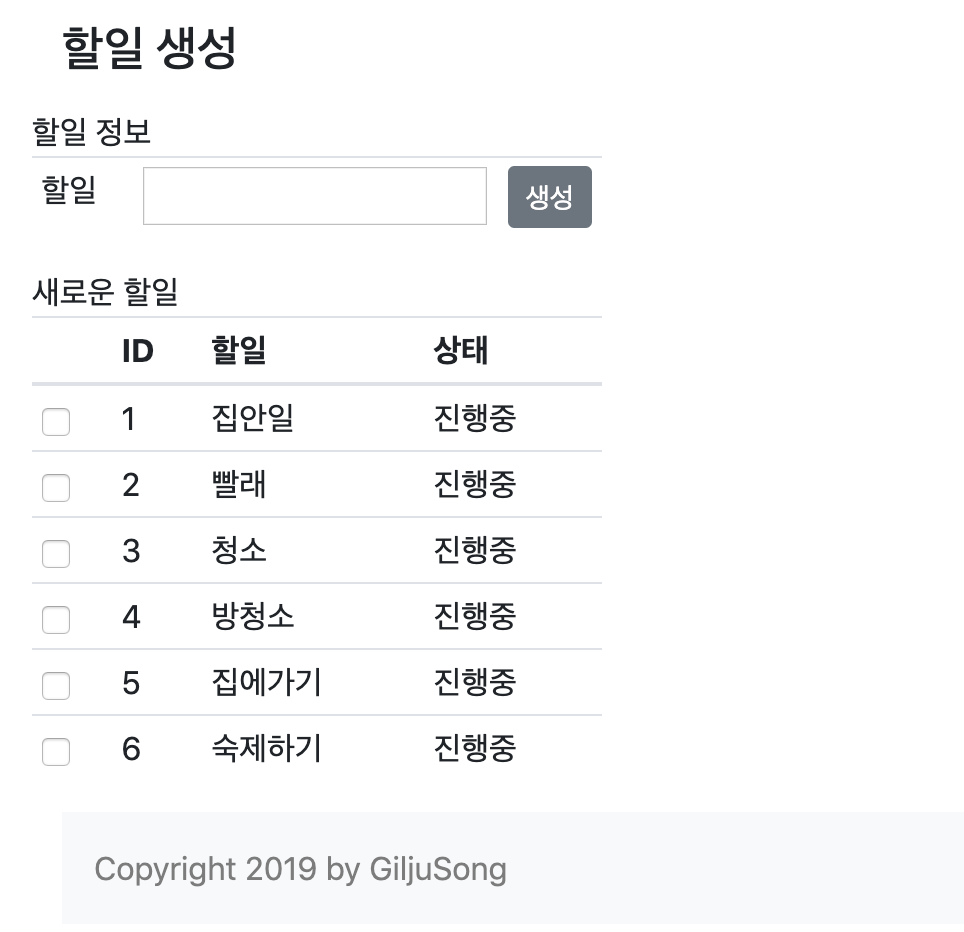

# TODO List Project - Web

## TODO List Project
#### 기능
* 사용자는 텍스트로 된 할일을 추가할 수 있다.
  * 할일 추가 시 다른 할일들을 참조 걸 수 있다.
  * 참조는 다른 할일의 id를 명시하는 형태로 구현한다. (예시 참고)
* 사용자는 할일을 수정할 수 있다.``
* 사용자는 할일 목록을 조회할 수 있다.
  * 조회시 작성일, 최종수정일, 내용이 조회 가능하다.
  * 할일 목록은 페이징 기능이 있다.
* 사용자는 할일을 완료처리 할 수 있다.``
  * 완료처리 시 참조가 걸린 완료되지 않은 할일이 있다면 완료처리할 수 없다. (예시 참고)

#### 목록조회 예시 및 설명
| id | 할일 | 작성일시 | 최종수정일시 | 완료처리 |
|----|-------------|---------------------|----------|---------------------|
| 1 | 집안일 | 2018-04-01 10:00:00 | 2018-04-01 13:00:00 |  |
| 2 | 빨래 @1 | 2018-04-01 11:00:00 | 2018-04-01 11:00:00 |  |
| 3 | 청소 @1 | 2018-04-01 12:00:00 | 2018-04-01 13:00:00 |  |
| 4 | 방청소 @1 @3 | 2018-04-01 12:00:00 | 2018-04-01 13:00:00 |  | 
                        | 1 | 2 | 3 | 4 | 5 |
* 할일 2, 3번은 1번에 참조가 걸린 상태이다.
* 할일 4번은 할일 1, 3번에 참조가 걸린 상태이다.
* 할일 1번은 할일 2번, 3번, 4번이 모두 완료되어야 완료처리가 가능하다.
* 할일 3번은 할일 4번이 완료되어야 완료처리가 가능하다.

## 프로젝트 구성
#### Dependencies
- spring-boot-starter-web
- spring-boot-starter-data-jpa
- spring-boot-starter-thymeleaf
- thymeleaf-layout-dialect
    - thymeleaf layout framework
- spring-data-commons
    - Pageable

#### 구동 방법
- rest-api 기반의 웹어플리케이션이기 때문에 rest-todo-list를 먼저 구동한다.
    - rest-todo-list application 서버 정보 적용
    - application.properties
        - server.port=8080 (web 어플리케이션 port 정보)
        - rest-todo-list.host=127.0.0.1 (rest-todo-list api host)
        - rest-todo-list.port=8081 (rest-todo-list api port)     
- maven build 및 application 구동
    - test 때문에 rest-todo-list application 을 반드시 먼저 구동해야 한다.
    - $ mvn clean package
    - $ cd target
    - $ jar -jar web-todo-list-0.0.1-SNAPSHOT.jar

#### 화면
-  할일 목록

-  할일 상세 - 내용 및 상태 수정

-  참조 수정 - 할일 참조 제외/추가

-  할일 등록 - 참조 할일 추가 가능

